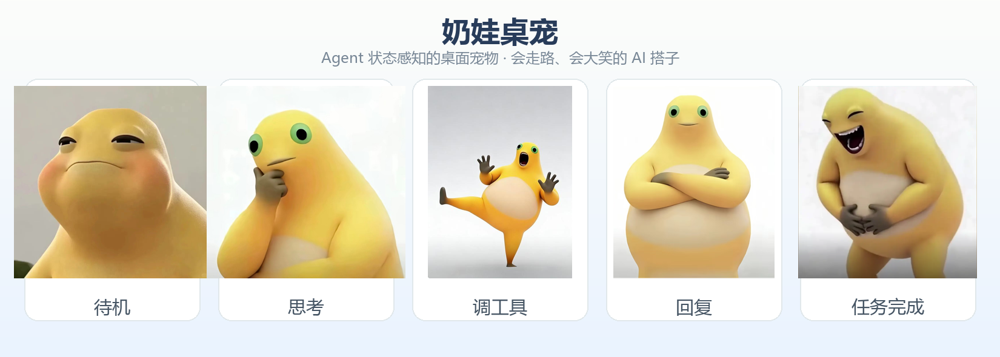
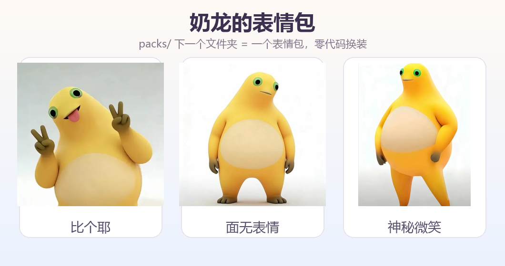

# 奶娃桌宠 v2.0.1（原生窗口版）

Agent 状态感知的桌宠插件。**v2.0 升级为透明桌面原生窗口**：无边框置顶、由 DSH 真实 Agent 事件驱动、托盘常驻——离开浏览器也能看到它在桌面上反映你的工作状态。同时保留**表情包框架**（`packs/` 下一个文件夹 = 一个表情包）。

- **v2.0.1**：右键菜单新增「开机启动 / 关于」；大笑音量默认 60%；端口被占用自动顺延并弹窗提示；运行日志写入 `%APPDATA%/pet-nailong/error.log`；自定义表情包与内置包合并加载（默认奶龙始终可用）；豆包/元宝/Kimi 等进程源任务完成也会大笑；拖拽时自动暂停走路；状态卡开关持久化；气泡长文本自动换行。

## 📸 长这样



透明桌面原生窗口：会走路、会大笑、会思考，跟随真实 AI 工作状态实时变脸。



## 功能特性

### 真实工作状态驱动（像 Codex 桌宠）
- **实时反映 Agent 工作状态**：监听 agent/status、tools/result、agent/inbox/inserted、agent/error
- **状态卡**：显示当前状态（空闲/思考中/调工具/回复中/任务完成/出错/来消息）+ 正在执行的工具名 + 工具次数 + 表情包名
- **任务完成大笑**：任务结束播放大笑 GIF + 原版笑声（6 秒完整播放，不会笑一半被掐断）
- 不是定时换皮——**它看见你真实的工作过程**，思考时托腮、调工具时震惊围观、出错时抖动、完成了捧腹大笑

### 透明桌面原生窗口
- **透明无边框置顶窗口**：直接显示在 Windows 桌面上
- **会走路**：三种模式（**自由散步 / 跟随鼠标 / 原地待着**，右键菜单切换，默认原地待着）
- **动画**：呼吸、摇摆、点击蹦跳、大笑 GIF 播放、出错抖动
- **交互**：左键**拖拽**（松手说话）、单击蹦跳+随机梗气泡、右键菜单（切换表情包/移动模式/大小/鼠标穿透/置顶/隐藏/退出）
- **托盘常驻**：任务栏图标，可唤出/隐藏/退出
- **思维链心声**：思考中偶尔冒灰色斜体气泡
- **崩溃自愈**：helper 崩溃自动重启，插件停用优雅关闭
- **优雅降级**：环境不支持子进程时退回浏览器 overlay

### 表情包框架
- `packs/<表情包>/pack.json` 定义状态→素材映射与气泡文案；启动自动扫描
- **右键桌宠 → 切换表情包** 实时换装（素材/音频/气泡全部跟随）
- 加新表情包 = 扔一个文件夹进 `packs/`，零代码

## 快速开始（推荐：一体化 exe）

**`pet-nailong-all.exe`**（单文件、无终端弹窗、双击即用）：
- 内置 HTTP 桥接 + 全 AI 状态监控 + 桌宠窗口，**一个进程全部搞定**
- 自动跟随所有主流 AI 软件：Codex / 豆包 / 腾讯元宝 / Claude / Gemini / DeepSeek /
  Kimi / 通义千问 / 智谱清言 / 文心一言 / 讯飞星火 / Cursor / Trae / Windsurf 等
- **无需安装 Python / PyQt5 / 任何依赖**，发布到 GitHub 别人解压即用
- 关闭方式：右键桌宠 → 退出，或托盘图标 → 退出

> 想要桌宠跟随自己机器上的其他 AI？把 `packs/` 放在 exe 同目录可扩展表情包；
> **自定义表情包 = 在 exe 同目录建 `packs/`，把表情包文件夹丢进去**，内置奶龙/变体仍然保留
> （同名包以你的为准）；用默认奶龙完全不需要任何外部文件夹。
> 监控清单内置在 exe 里，也可用源码模式跑 `bridge/ai_monitor.py` 自定义。

## 源码模式开发

```powershell
# 一体化运行（窗口+桥接+监控，单进程，无终端）
python helper\all_in_one.py

# 分开跑（调试用）
python bridge\server.py          # 桥接服务
python bridge\ai_monitor.py      # 全 AI 监控
python bridge\push.py thinking   # 手动推状态

# 打包一体化 exe（用内置 PyInstaller，无网络依赖）
.\build-all.ps1                  # 产出 pet-nailong-all.exe + zip
```

## 目录结构

```
pet-nailong/
├── helper/
│   ├── all_in_one.py        # ★ 一体化入口（窗口+桥接+监控同进程）
│   ├── main.py              # 传统 helper（插件/协议模式）
│   ├── pet_window.py        # 透明置顶窗口：渲染/动画/交互/气泡/状态卡
│   ├── animations.py        # 动画引擎
│   ├── packs.py             # 表情包加载
│   ├── protocol.py          # JSON-lines 协议（stdio）
│   ├── tray.py              # 托盘
│   └── pet_all.spec         # PyInstaller 打包配置
├── bridge/
│   ├── server.py            # 桥接 Host：HTTP API + 状态机（支持进程内模式）
│   ├── ai_monitor.py        # ★ 全 AI 统一监控器（Codex 事件 + 进程活动）
│   ├── auto_monitor.py      # 旧版单软件监控（豆包，已弃用）
│   ├── ai_apps.json         # ★ 监控清单（增删 AI 软件零代码）
│   └── push.py              # 手动推送工具
├── host/                    # Cordis 插件 host（agent 事件状态机）
├── client/                  # 浏览器 overlay（降级路径）
├── packs/                   # 表情包仓库（nailong / variants）
├── icons/                   # 图标
├── build-all.ps1            # ★ 一键打包一体化 exe + zip
└── README.md
```

## 表情包框架

### pack.json 清单格式
```json
{
  "id": "nailong",
  "name": "奶龙猎奇版",
  "emoji": "🐲",
  "version": "1.0.0",
  "laugh": { "gif": "laugh.gif", "mp3": "laugh.mp3" },
  "states": {
    "idle":      ["03-idle/01-half-lidded.png"],
    "thinking":  ["04-think/01-green-eye-chin.png"],
    "tool_call": ["05-shock/01-green-eye-kick.png", "05-shock/02-green-eye-headgrab.png"],
    "streaming": ["06-serious/01-green-eye-arms-crossed.png"],
    "task_done": ["01-laugh/01-classic-reference.png"],
    "error":     ["01-laugh/01-classic-reference.png"]
  },
  "bubbles": { "idle": "摸鱼中…", "task_done": "哈哈哈哈" },
  "clickBubbles": ["哈哈哈哈", "看我干嘛"],
  "thinkingLines": ["（假装在思考）", "（摸鱼被发现了）"]
}
```

### 加一个表情包（3 步，零代码）
1. 复制 `packs/nailong/` 为 `packs/你的包名/`
2. 清空图片换成你的素材
3. 改 `pack.json`：id / name / 素材路径 / 气泡文案

## 架构（一体化）

```
AI 软件（Codex 会话事件 / 豆包等进程活动）
       │  进程内线程
       ▼
all_in_one.exe（单进程）
├── ai_monitor 线程：采样 + 合并 → HTTP 推状态
├── server 线程：HTTP 桥接 + 状态机（127.0.0.1:18923）
└── PyQt 主线程：透明桌宠窗口（Qt 信号驱动，线程安全）
```

## 监控清单（ai_apps.json）

`bridge/ai_apps.json` 可增删软件（type=codex 精确事件 / type=process 进程活动），
源码模式改后重启生效。exe 内置清单，如需自定义请用源码模式。

## License

MIT
